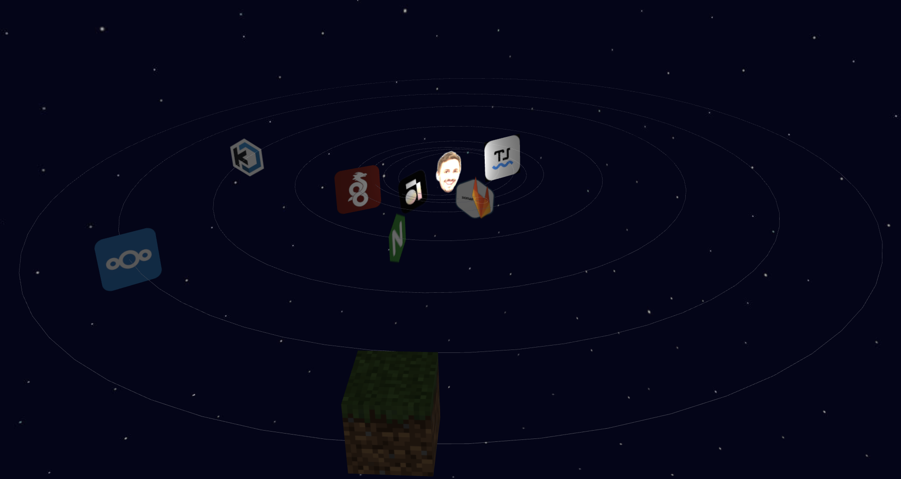

# Battaglini.fr

 
[](http://192.168.1.10:9000/dashboard?id=Tireur2cables_battaglini.fr_AY7jYJIiOdaeigZuWfUP)

## What is it ?

[battaglini.fr](battaglini.fr) is a website representing some of my self-hosted projects in a solar system way.  
The website is developped with Vue.js and Three.js.



## Base model repository

This repository is a fork of [honzaap's](https://github.com/honzaap) [solar system](https://github.com/honzaap/SolarSystem) repository.

## How does it work? 

- Move around the techno system with your mouse (hold left click, move your mouse and play with the wheel)
- Click on service icon to find out more about it
- Select the desired service with side menu

## Installation

- Clone repository to your local machine:  
```bash
git clone https://github.com/Tireur2cables/battaglini.fr
```
- Go into repository folder:
```bash
cd battaglini.fr
```
- Install dependencies:  
```bash
npm install
```
- Run the website:  
```bash
npm run dev
```

## How to contribute

If you want to contribute to the project, you can open an issue.  
You also can open a merge request solving one ore more issues.  